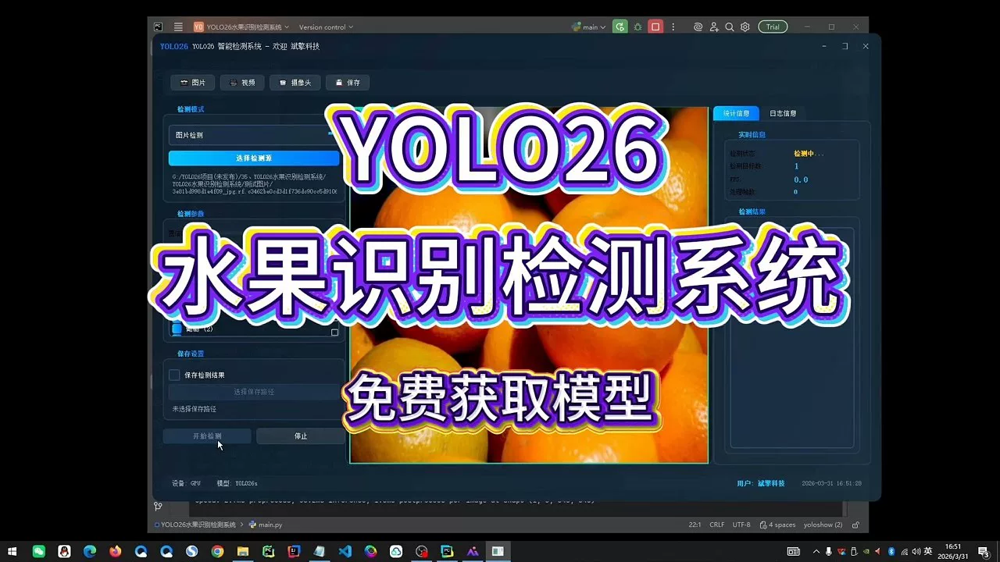
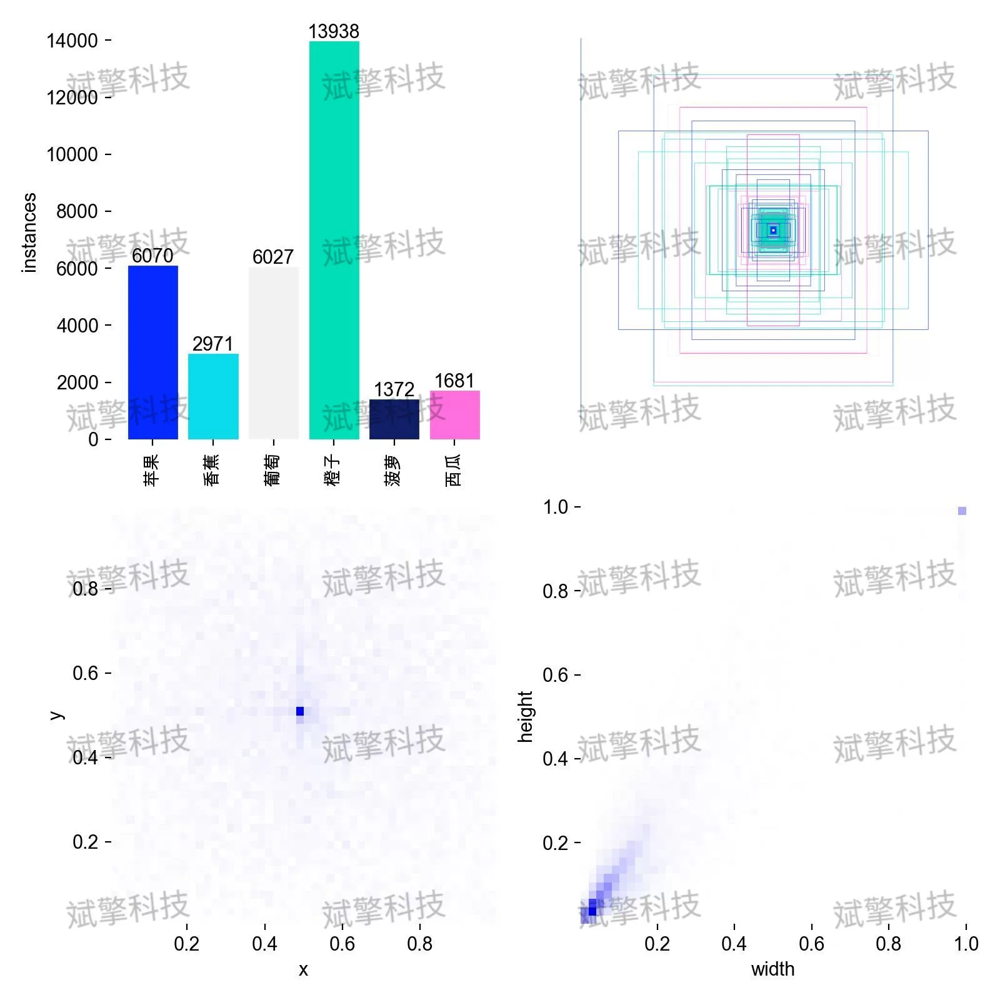
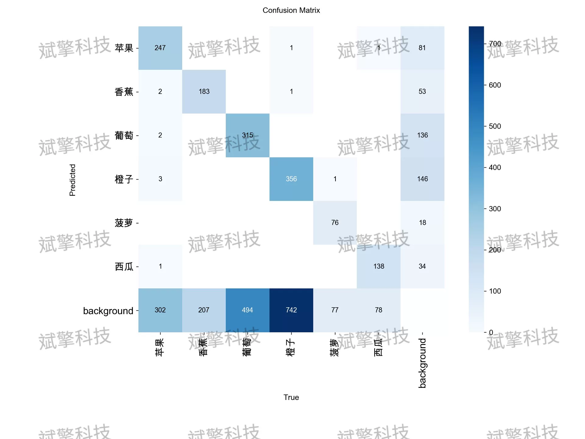
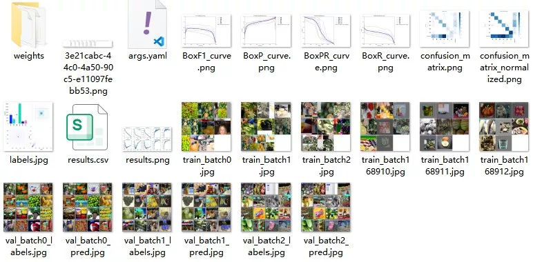
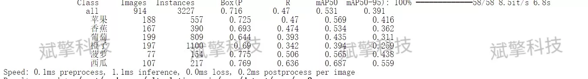
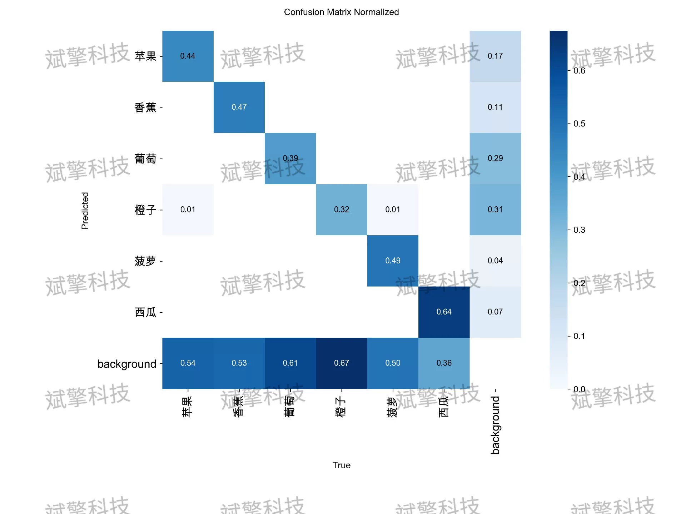
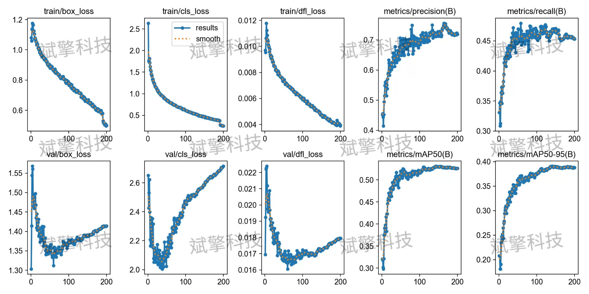
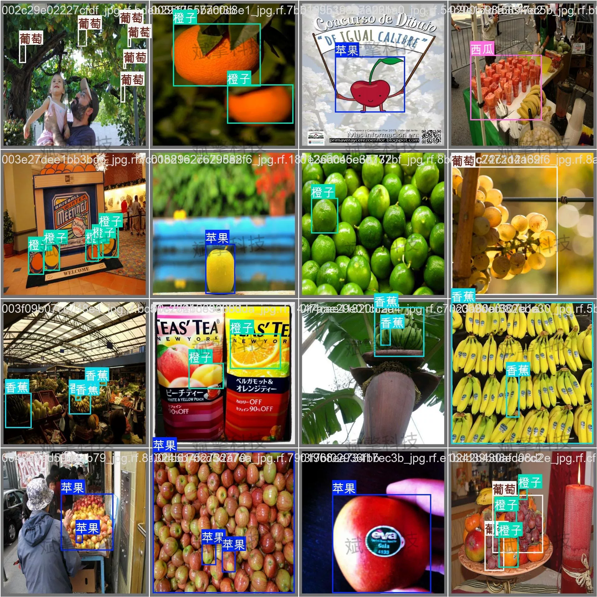
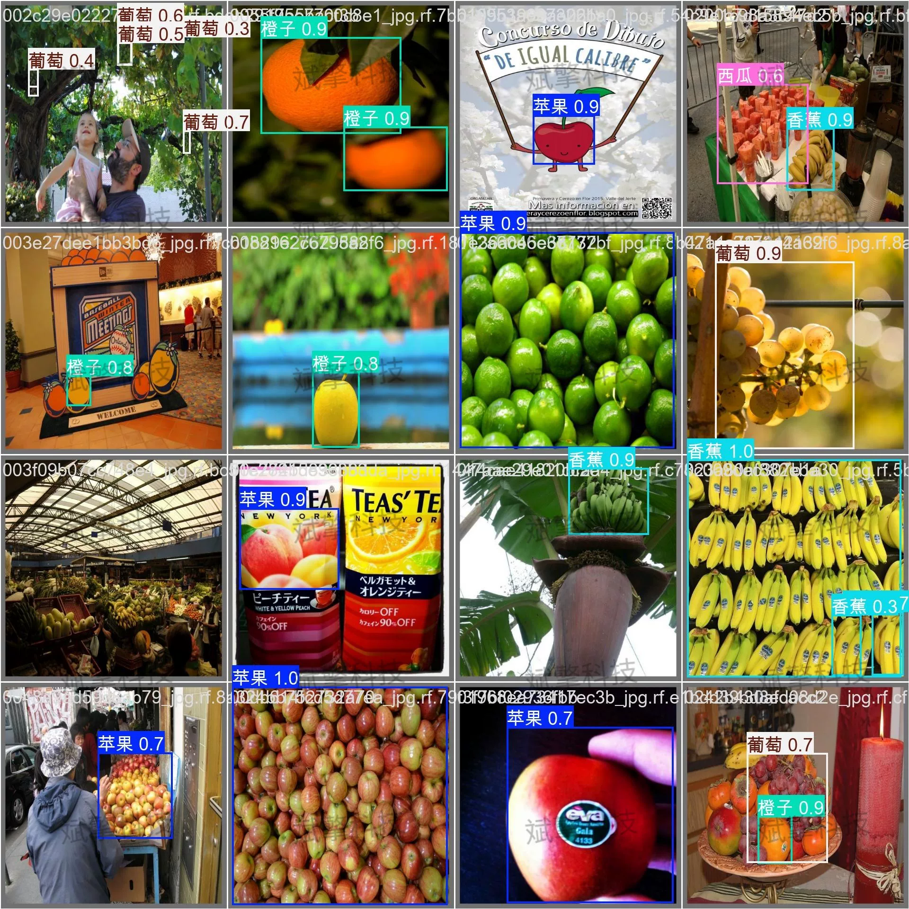

# YOLO26 Fruit Detection System | UI Interface

## Body

YOLO26 Fruit Recognition and Detection System | UI Interface for the YOLO26 Real-Time Fruit Detection System, Training to Deployment, Covering Apples/Bananas/Grapes/Oranges/Pineapples/Watermelons, Over 7000+ Images Trained

This paper designs and implements a fruit recognition detection system based on the YOLO26 architecture, aiming to solve the problem of real-time localization and classification of multiple fruits in complex scenarios. The study focuses on six common fruits: apples, bananas, grapes, oranges, pineapples, and watermelons, constructing a specialized dataset containing 7108 training images, 914 validation images, and 457 test images. The experiment uses YOLO26 for training, enhancing detection performance through loss function optimization and multi-scale feature fusion strategies. This research provides feasible technical solutions for intelligent harvesting, automatic sorting, and retail settlement in agricultural and commercial scenarios.

Covering six common fruits: apples (Apple), bananas (Banana), grapes (Grape), oranges (Orange), pineapples (Pineapple), and watermelons (Watermelon). The dataset is divided according to standard machine learning methods into three parts: training set, validation set, and test set, with specific quantities as follows:
Training Set (Training Set): A total of 7108 images.
Validation Set (Validation Set): A total of 914 images.
Test Set (Test Set): A total of 457 images.

Free reservation for remote installation. Unsuccessful refund guaranteed.
Purchase Enjoy the following resources (Automaticly unlocked in Baidu Cloud):
   YOLO Recognition Detection Project Complete Source Code
   YOLO format datasets
   Combined training code + UI interface code
   Combined trained model + results image
   Software installation package
   Add WeChat for remote installation (Automatically display WeChat ID after purchase) - Unsuccessful refund guaranteed

⚙️ Core Function Modules
Detection Capability
    Image Detection: Upon upload, return detection boxes + category information
    Video Detection: Support video files, analyze frames accurately
    Camera Real-Time Detection: Connect USB camera, achieve dynamic monitoring
Interaction and Control
    Target Selection: Choose one or more categories for detection
    Parameter Real-Time Adjustment: Adjustable confidence threshold & IoU threshold, flexibly control accuracy
    Result Save: One-click save images/video/camera detection results
System and Data
    User Registration and Login: Support password strength detection + Encrypted storage
    Log Recording: Automate operation and error logging (with timestamp)

## Images

## Payment

Here is a pay link on Stripe ( https://buy.stripe.com/3cs8yP7sY87d0vu9AB ). Please contact me lonlonago@foxmail.com after funding $89, and I will send you a complete data files , thank you!

